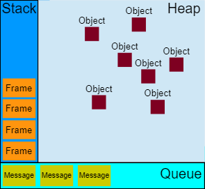
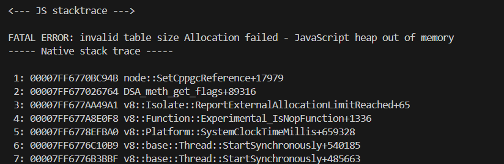

### Лабораторна робота №3 (Женя ☻)

#### Завдання: продемонструвати як створити обєкт на стеку

Користуючись наступним [Джерелом](https://developer.mozilla.org/en-US/docs/Web/JavaScript/Event_loop), можна зробити висновок, що всі об'єкти створюютья на heap, внаслідок чого я не знаю як продемонструвати створення об'єкту на стеку :( ...

#### Завдання: продемонструвати як створити обєкт на хіпі

Оскільки задопомогою try...catch не вийшло зловити помилку "heap out of memory"

        function allocatedHeap() {
            try {
                const arr = [];
                while(true) {
                    arr.push(new Array(2**31).fill(0))
                } 
            } catch(e: Error | any) { 
                return e.message;
            }
        };
    

Демонстрацію створення об'єкту на хіпі було вирішено, продемонструвати наступним чином:
    
    * запам'ятати нинішній об'єм викоростаної пам'яті;
    * створити об'єкт на хіпі;
    * знайти різницю між нинішнім об'ємом пам'яті та об'ємом, що був до створення об'єкта;
    * отримана різниця повина бути більша за 0.
